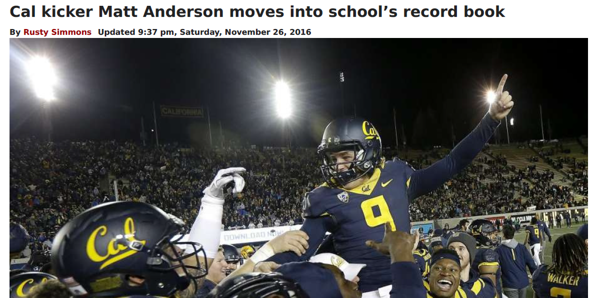
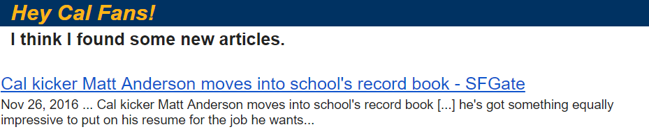

# Oski
Oski archives articles of Cal football placekickers. Oski searches the web for new articles, archives the results, and sends an email notification to subscribers.

### Implementation
Oski's search capabilities utilize the Google Custom Search API. To use this API, you must request a developer key and define your own custom search engine. For more details, check out the [Google Custom Search API](https://developers.google.com/custom-search/json-api/v1/overview). I also recommend checking out the [Custom Search Parameters](https://developers.google.com/custom-search/json-api/v1/reference/cse/list) to see the available options.

Oski emails the results of his searching to a subscriber list. I recommend using a dedicated email account to issue notifications; sending messages through Gmail requires enabling less secure applications. More details at [Allowing less secure apps](https://support.google.com/accounts/answer/6010255).

Article results are stored in a sqlite database. Oski also converts each article web page into a pdf document. The goal of this program is to maintain a complete article archive throughout the season!

### Parameters
This golden bear is good at more than just football. The Oski parameter files were designed in such a way that Oski can search and archive any selected topics.

Take a look at the [Example Parameter Files](Oski/ExampleParameters). The main input to the script is *OskiParams.json*. Here, you can define your search queries. *BannedDomains.txt* allows you to filter sites from search results. *Subscribers.txt* simply lists each of Oski's email subscribers.

### *Go Bears!*
